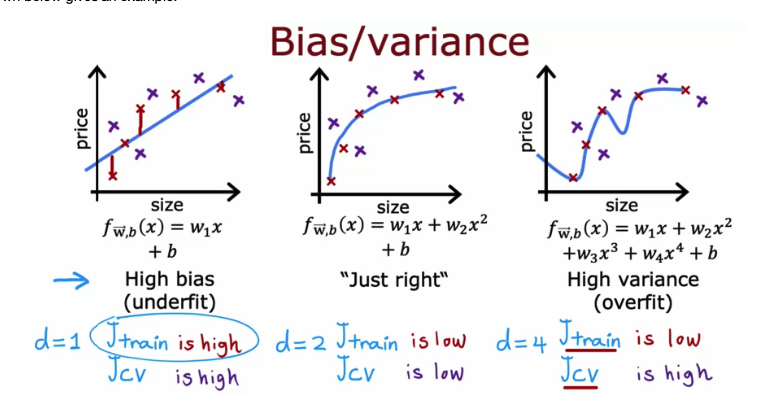

# machine-learning-notes

The notes of machine learning here is based on the specialization of machine learning on Coursera.
The specialization contains 3 courses and each folder in this repository corresponds to one course.

Folders:

- [supervised_learning: Supervised Machine Learning: Regression and Classification](https://www.coursera.org/learn/machine-learning)
- [neural_network: Advanced Learning Algorithms](https://www.coursera.org/learn/advanced-learning-algorithms/home)
- [unsupervised_learning: Unsupervised Learning, Recommenders, Reinforcement Learning](https://www.coursera.org/learn/unsupervised-learning-recommenders-reinforcement-learning)

### Good to know

- Overfitting is when the model fits the noise, not the underlying process.
- High variance: too complex model, too many features, overfitting
- Underfitting is when the model is too simple to fit the underlying process.
- High bias: too simple model, not enough features, underfitting
- Regularization: keep all the features, but reduce the magnitude of the parameters θ
- λ is the regularization parameter. It determines how much the costs of our θ parameters are inflated.
- If λ is too large, it may smooth out the decision boundary and cause underfitting.
- If λ is too small, it may cause overfitting.

### Debugging a learning algorithm

#### Fix High Variance / Overfitting:

- Get more training examples
- Try smaller sets of features
- Try increasing λ

#### Fix High Bias / Underfitting:

- Try getting additional features
- Try adding polynomial features (x1^2, x1x2, x2^2, ...)
- Try decreasing λ
